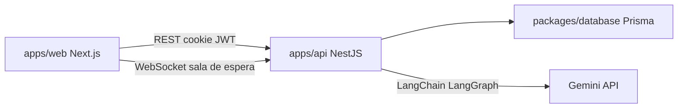

# turnos-mvp

Sistema web de gestión de turnos clínicos (single-tenant). Monorepo **Next.js** + **NestJS** + **Prisma/PostgreSQL**, desarrollado con agentes de IA en **Cursor** y metodología **Spec-Driven Development (OpenSpec)**.

Este README actúa como bitácora del Trabajo Práctico Integrador: arquitectura, casos de uso entregados, ecosistema de AI Engineering y configuración de MCP.

---

## Arquitectura

Monorepo con **pnpm workspaces** + **Turborepo**:

| Capa | Ubicación | Rol |
| :--- | :-------- | :-- |
| Frontend | `apps/web` | Next.js (App Router), shell autenticado, agenda, sala de espera, chatbot de ayuda |
| Backend | `apps/api` | NestJS REST + WebSocket, JWT en cookie `httpOnly`, módulos por dominio |
| Datos | `packages/database` | Prisma: schema, migraciones y seed |
| Contratos | `packages/shared-types` | Tipos compartidos web ↔ API |
| Tooling | `packages/config` | ESLint, Prettier, tsconfig base |

**Flujo operativo:** login (Argon2 + JWT) → agenda (crear, confirmar, cancelar, reprogramar) → consultorios → llamado del médico → evento en tiempo real → pantalla de aviso en sala de espera.

**Chatbot de ayuda:** asistente de documentación de usuario en el shell autenticado (FAB AYUDA BOT). No es un caso de uso operativo; cumple el requisito académico de chatbot con LangChain (ver más abajo).



Documentación de decisiones: [`docs/adr/`](docs/adr/) (monorepo, OpenSpec, Context7). Requisitos funcionales: [`docs/FUNCIONAL.md`](docs/FUNCIONAL.md).

---

## Diez casos de uso entregados

Lista operativa del sistema para el criterio de funcionalidad del TP. Detalle funcional en [`docs/FUNCIONAL.md`](docs/FUNCIONAL.md) y justificación de los dos CU incorporados por prioridad en **§14 Anexo**.

| # | Caso de uso | Actor principal |
| :-: | :---------- | :-------------- |
| 1 | Iniciar sesión | Usuario (todos los roles) |
| 2 | Crear turno | Recepcionista |
| 3 | Confirmar turno | Recepcionista |
| 4 | Cancelar turno | Recepcionista |
| 5 | Consultar agenda propia | Médico |
| 6 | Configurar consultorio de médico | Recepcionista |
| 7 | Llamar turno para sala de espera | Médico |
| 8 | Transmitir pantalla de aviso | Recepcionista |
| 9 | Cerrar sesión | Usuario (todos los roles) |
| 10 | Reprogramar turno | Recepcionista |

**Reprogramar turno:** edición de un turno `PROGRAMADO` de hoy o futuro (fecha, hora y datos del formulario) vía `PATCH /api/turnos/:id` desde el popup de detalle en la agenda.

Los CU originales de la propuesta académica **Dar de alta usuario** (CU 2) y **Bloquear agenda de médico** (CU 6) permanecen definidos en [`docs/FUNCIONAL.md`](docs/FUNCIONAL.md) §10 pero **pendientes de implementación**. Se priorizaron cierre de sesión y reprogramación por necesidad operativa del circuito diario (ver anexo §14).

---

## AI Engineering — ecosistema de desarrollo

### Cursor como IDE de orquestación

Se eligió **Cursor** por integración nativa de Agent, reglas de contexto persistentes, skills de proyecto y servidores MCP. El desarrollo operativo se delegó a agentes autónomos guiados por especificaciones versionadas, no por prompts sueltos sobre el repositorio completo.

### Instrucciones de sistema (contexto para agentes)

| Documento | Rol |
| :-------- | :-- |
| [`AGENTS.md`](AGENTS.md) | Convenciones de código, estructura, testing, skills y MCP |
| [`docs/FUNCIONAL.md`](docs/FUNCIONAL.md) | Qué debe hacer el sistema: roles, reglas de negocio, casos de uso |
| [`docs/adr/`](docs/adr/) | Decisiones de arquitectura y proceso (monorepo, OpenSpec, Context7) |
| [`openspec/specs/`](openspec/specs/) | Contrato operativo vigente por dominio |
| [`openspec/changes/`](openspec/changes/) | Propuestas en curso (deltas antes de archivar) |

### Spec-Driven Development (OpenSpec)

Metodología adoptada para traducir requisitos en código de forma controlada:

1. **Propose** — change con `proposal.md`, deltas en `specs/` y `tasks.md`.
2. **Apply** — implementación guiada por el delta y checklist de tareas.
3. **Archive** — merge del delta a `openspec/specs/` cuando el change está verificado.

Comandos Cursor: `/opsx-explore`, `/opsx-propose`, `/opsx-apply`, `/opsx-archive`, `/opsx-sync`. Skills asociadas en `.cursor/skills/openspec-*`.

**Patrón de iteración:** cada feature = un change OpenSpec → skill de dominio (`frontend-coder`, etc.) → tests unitarios → verificación manual. Los loops de autocorrección son lint, tests y revisión contra el spec, no reescritura ad hoc.

### Skills de implementación

| Skill | Cuándo |
| :---- | :----- |
| `openspec-explore` / `openspec-propose` / `openspec-apply-change` / `openspec-archive-change` | Ciclo SDD |
| `frontend-coder` | UI, páginas y componentes en `apps/web` |
| `react-doctor` | Cierre de cambios de UI |
| `lib-docs` | Auditoría de APIs de librerías vía Context7 |

### Servidores MCP (desarrollo)

Integración de **dos servidores MCP externos** en el flujo de desarrollo. **No** forman parte del runtime desplegable (`apps/web`, `apps/api` ni chatbot del producto).

| MCP | Namespace | Rol en el desarrollo |
| :-- | :-------- | :------------------- |
| **Context7** | `plugin-context7-plugin-context7` | Documentación actualizada de librerías del stack (Next.js, NestJS, Prisma, Tailwind, LangChain, etc.). Usado vía skill `lib-docs` (`/lib-docs`) para evitar APIs deprecadas. |
| **Stitch** | `user-stitch` | Generación e iteración de mockups de pantallas a partir de descripciones. Se usa **antes** de implementar UI nueva; el código final se escribe con `frontend-coder` y design tokens. |

Ambos se habilitan en Cursor (Settings → MCP). No requieren configuración en el código del monorepo.

### Chatbot del producto (LangChain + Gemini)

Requisito académico aparte de los 10 CU operativos:

- **Framework:** LangChain.js + LangGraph (`classify` → generate | refuse).
- **Corpus:** markdown de ayuda en [`docs/ayuda/`](docs/ayuda/).
- **Endpoint:** `POST /api/chatbot/mensajes` (autenticado, todos los roles).
- **LLM:** **Google Gemini** vía `@langchain/google-genai`.
- **Configuración:** `GOOGLE_API_KEY` y `GEMINI_MODEL` en `apps/api/.env` (ver [`apps/api/.env.example`](apps/api/.env.example)). La clave **nunca** va en `apps/web` ni en el bundle del navegador.

**Distinción:** Cursor + sus MCP orquestan el **desarrollo**; Gemini responde al **operador de la clínica** dentro de la aplicación desplegada.

---

## Requisitos

- Node.js 22+
- pnpm 10+
- PostgreSQL en `localhost:5432` (usuario `postgres`, password `root`)

## Primera vez

```bash
cp packages/database/.env.example packages/database/.env
cp apps/api/.env.example apps/api/.env
```

Completar `GOOGLE_API_KEY` en `apps/api/.env` si se quiere probar el chatbot de ayuda.

Crear la base (PowerShell):

```powershell
$env:PGPASSWORD='root'
psql -h localhost -p 5432 -U postgres -c "CREATE DATABASE turnos_mvp;"
```

Luego:

```bash
pnpm install
pnpm db:migrate
pnpm --filter @turnos/database build
pnpm --filter @turnos/database db:seed
pnpm dev
```

| URL                              | Qué     |
| -------------------------------- | ------- |
| http://localhost:3000            | Web     |
| http://localhost:3001/api/health | API     |
| http://localhost:3001/api/docs   | Swagger |

Usuarios de desarrollo (password `Admin123!@#$`): `admin@clinica.local`, `recepcion@clinica.local`, `medico@clinica.local`.

## Día a día

```bash
pnpm install   # si cambiaron dependencias
pnpm --filter @turnos/database build
pnpm dev
```

## Tras cambios de base de datos

Con PostgreSQL corriendo:

```bash
pnpm db:migrate
pnpm --filter @turnos/database build
pnpm --filter @turnos/database db:seed   # solo si hace falta re-sembrar usuarios
pnpm dev
```

`pnpm db:migrate` aplica migraciones pendientes. Si editaste `packages/database/prisma/schema.prisma`, Prisma pide un nombre y genera la migración nueva.
